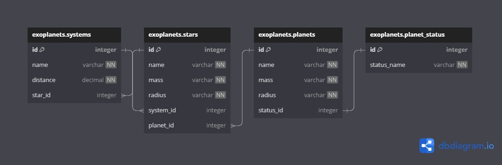

# Exoplanets

API for working with NASA exoplanet data.

## Getting started

### Prerequisites

* .NET SDK installed

```shell
dotnet --version
7.0.403
```

### Build

To build the application enter command `dotnet build`.

```shell
$ dotnet build

MSBuild version 17.7.3+4fca21998 for .NET
  Determining projects to restore...
  All projects are up-to-date for restore.
  exoplanets -> /Path/to/project/app/bin/Debug/net7.0/exoplanets.dll

Build succeeded.
    0 Warning(s)
    0 Error(s)

Time Elapsed 00:00:00.30
```

### Run

To run the application enter command `dotnet run`.

```shell
dotnet run
Building...
info: Microsoft.Hosting.Lifetime[14]
      Now listening on: http://localhost:5000
info: Microsoft.Hosting.Lifetime[0]
      Application started. Press Ctrl+C to shut down.
info: Microsoft.Hosting.Lifetime[0]
      Hosting environment: Development
info: Microsoft.Hosting.Lifetime[0]
      Content root path: /path/to/project/dir
```

### Swagger

After running the application, navigate to `localhost:<port>/swagger` to view openAPI docs.

## Roadmap

* [x] Create exoplanets schema
* [ ] Systems
  * [x] Create a systems table
  * [ ] POST a system
  * [ ] GET a system
  * [ ] GET all systems
* [ ] Stars
  * [x] Create a stars table
  * [ ] POST a star
  * [ ] GET a star
  * [ ] GET all stars
* [ ] Planets
  * [x] Create a planets table
  * [x] Create a planets_status table
  * [ ] POST a planet
  * [ ] GET a planet
  * [ ] GET all planets
* [ ] Use HttpClient to integrate with NASA exoplanet archive.

## Tech stack

* Microsoft SQL Server 2022
* C#/.NET 7
* ASP.NET Web API
* Entity Framework (database first)

## Diagrams


